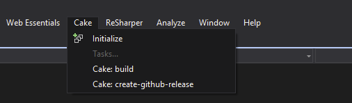

## VisualStudio.Cake

## Features

### Initialize build script

- build.ps1
- build.cmd
- build.sh
- build.cake

### Execute task from main menu

## Enabling execution of PowerShell script in Visual Studio

-  Start Windows PowerShell (x86) as Administrator
-  Run `Set-ExecutionPolicy RemoteSigned`
